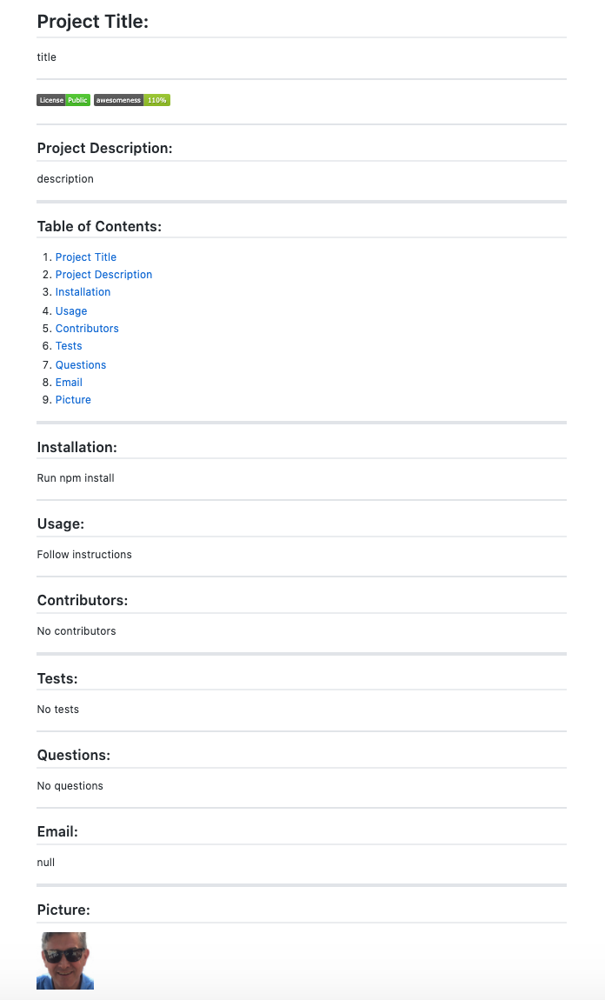

# Generate Repository README Markdown File


The README file is extremely important because it introduces and explains your projects. It contains vital information to understand what the project is about. It should answer most of the audience's questions about how to use the repository and collaborate.

The README is traditionally written in uppercase characters, so it is more prominent. Althought, it is not mandatory to be uppercase.

The README file should be the first file you create in a new project. It should be populated with information every time you update the project. It should be also the last file to finish, in order to show the finish product of your project with an animated gif or a screenshot of your deployed web app.

The README file should be placed in the top level directory of the project. Code hosting services such as [GitHub](https://github.com/), [Bitbucket](https://bitbucket.org/), and [GitLab](https://about.gitlab.com/) will look for the README file and display it along with the list of files and directories in your project.

The README file can be written in any text file format, but the most common is __markdown__ because it allows to add some lightweight formatting.

A CLI application will allow for quick and easy generation of a project README file to get started quickly. This will allow a project creator to spend more time working on finishing the project and less time creating a good README file.

## Screenshot - CLI Generated README Markdown File



## Repository URL

[TPZ CLI Generated Readme File Repo](https://github.com/tomaspz/generate-repo-readme-file)

## Installation Instructions in Your Repository

1. Copy and paste the directory __utils__ and all its contents in your repository directory.
2. Copy and paste __index.js__ and __package.json__ into your repository directory.
3. At the CLI, change to your repository directory.
4. At the CLI, run: 

```sh
npm install
```
5. At the CLI, run:

```sh
node index.js
```
6. At the CLI, answer the questions. 

Notes:
* Your GitHub username is mandatory in order to get your profile information (email and picture).
* The license question will create a badge witht the choice you select.
* The project title and description are important, although you can always edit them later.
* You can accept the rest of the defaults by pressing the __Enter__ key at the CLI, or you can write your own choices.
* The README file created will have your GitHub username preppended in the following format: __username-README.md__.

## What this application does

This is a command-line application that dynamically generates a README file from a user's input. The application is invoked at the CLI with the command:

```sh
node index.js
```

1. The user is prompted for their GitHub username. 
2. In the background, the GitHub username is used to retrieve the user's GitHub email and profile image. 
3. The user is prompted with questions about their project:
    * Project title
    * Project Description
    * Table of Contents (default: T.O.C with these bullet points)
    * Installation (default: npm install)
    * Usage (default: follow instructions)
    * License (choices: MIT, Public, GNU, Copyleft, Propietary)
    * Contributing (default: no contributors)
    * Tests (default: no tests)
    * Questions (default: no questions)
4. The user email and picture are retrieved from Github and added at the end of the README.md file.

## User Story

```
AS A developer

I WANT a README generator

SO THAT I can easily put together a good README for a new project

WHEN I start my project in the command-line,
THEN I want to easily answer the required questions to create a good README.md file,

WHEN I work on the README.md file,
THEN I want my GitHub email and picture included automatically,

WHEN the README file is generated,
THEN I just need some small editing to finish it
```

## Suggestions for a good README file

Every project is different and some suggestions may not apply to the project. It is always better to have a too long and detailed README file than a too short one. Suggestions:

* __Project Name__: a self-explaining name for the project.
* __Project Description__: a good description of the project, describing what the project can do for the user.
* __Links__: add links to any reference that might be unfamiliar to the visitors. 
* __Features__. 
* __Project Alternatives__.
* __Badges__: these are small images with metadata. They can indicate multiple things, like which tests passed for the project. We used [Shields](https://shields.io/) to add some badges. 
* __Screenshots, Gifs, or Videos__: it is a good idea to include screenshots, animated gifs or videos. We used [Giphy Capture](https://apps.apple.com/us/app/giphy-capture-the-gif-maker/id668208984?mt=12) to create an animated gif. Showing how the command line works with a animated gif is very useful for the user.
* __Requirements__: include all necessary information if the project only runs in a specific context (Ex: ES6, MacOS X) or has dependencies that have to be installed manually.
* __Installation Instructions__: consider that whoever is reading the README file is a novice and need assistance with the installation. List each step in the installation process to remove any ambiguity and make things easier for the user. 
* __Usage__: provide a lot of examples to the user and show the expected output. Provide links to the examples if they are too long to include in the README file.
* __Support__: where can the users go for help?. You can provide an issue tracker, a chat room, or an email address.
* __Future Development__: provide ideas for future releases.
* __Contributions__: are you open to contributions? What are the requirements to accept contributions?.
* __Documentation__: provide any documentation to developers that want to use your project and make changes. Document commands to lint the code. Have instructions to run tests in a server or in a browser.
* __Authors__: list your contributions or your collaborator's contributions.
* __Acknowledgment__: show appreciation for people that have contributed to the project.
* __License__: for open source projects, say how it is licensed.
* __Project Status__: add a note at the top of the README file about the development status of the project. 
